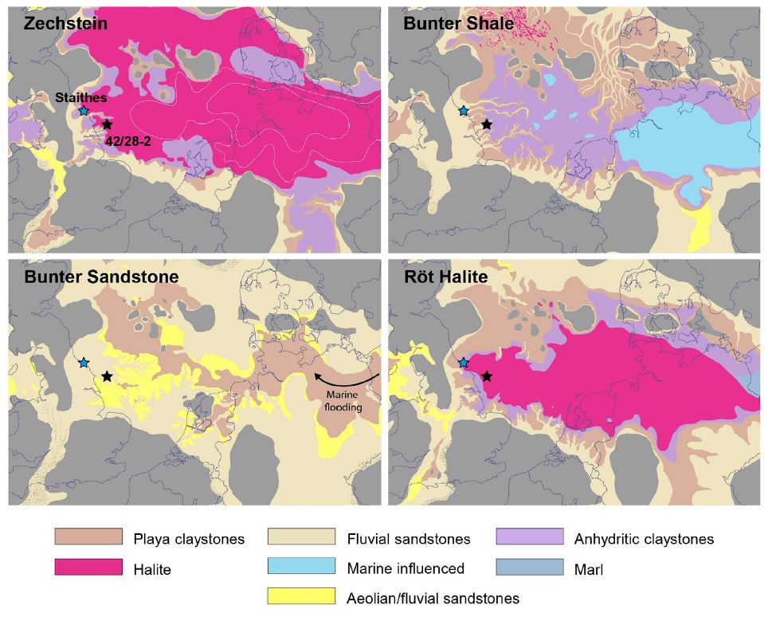
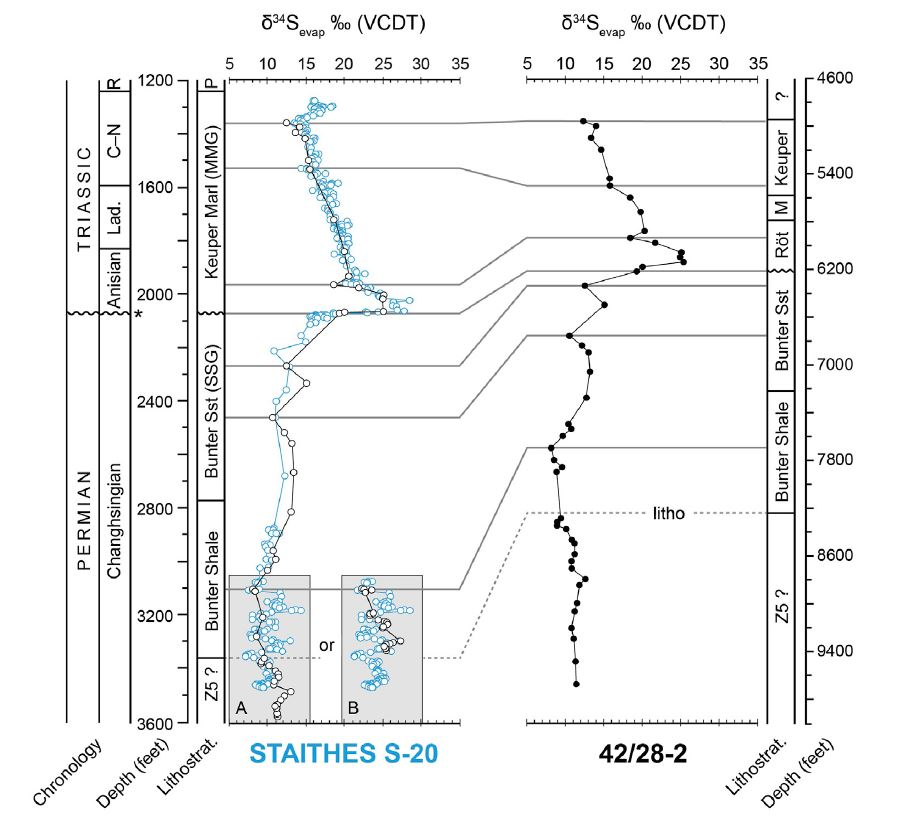

The goal of this tutorial is to take stratigraphic data from two sections and shift and stretch or squeeze one section relative to the other, to align them:

```{r introductory plot of sections and alignment, echo = FALSE, fig.width=5, fig.height=5}
#| label: fig-3
#| fig-cap: 
#|  - "Sulphur isotope data from two sites on their original depth scale. "
#|  - "North Sea data has been shifted and squeezed to align with the Staithes data."
#| layout: [[48,-4, 48]]
library(StratoBayes)
result <- readRDS("data/model-result-1.rds")
plot(result$data, xlab = expression(delta^{34}*S[evap]))
plot(result, main = "", xlab = expression(delta^{34}*S[evap]))

```

In the figure above, the depths associated with the sulphur isotope data from a North Sea well (blue) have been transformed to match the data from the Staithes well (red).

Below is a step-by-step guide to correlate the two wells using the `StratoBayes` R package, starting with an introduction to the data sets involved.

# Permian -- Triassic sulphur isotope data

The Permian-Triassic strata of the United Kingdom are difficult to date due to a scarcity of biostratigraphic constraints. Salisbury et al. (2023) have used sulphur isotope ratios from evaporites ($\delta^{34}S_{evap}$) to correlate a a well from the southern North Sea Basin (42/28-2) with a drillcore from Staithes (Cleveland Basin, Yorkshire, UK). The $\delta^{34}S_{evap}$ of evaporites is assumed to reflect the ceoval isotopic composition of seawater.

{#fig-1}

The authors correlated the two curves by visually matching several peaks and troughs of the $\delta^{34}S_{evap}$ curves:

{#fig-2}

We will now try to recreate that correlation using StratoBayes.

# Preparing the data

We have downloaded the data from the North Sea well from the Supplementary Materials of [Salisbury et al. (2023)](https://doi.org/10.3389/feart.2023.1216365), and received the data from Staithes from the authors of [Salisbury et al. (2022)](https://doi.org/10.1038/s41598-022-21542-4). These data were saved as .xlsx files. To facilitate reading the data in R, we copied the relevant data (depth and $\delta^{34}S_{evap}$ measurements) into new Excel spreadsheets with clean column names, and saved them as .csv files.

For reading the files, we first check what our working directory is:
```{r getwd}
getwd()
```
If you are running the code chunks in the `StratoBayes1_Correlation.qmd` file, your working directory will be wherever that file is saved. Otherwise, if you are running the code from a regular R script, you can set your desired working directory using `setwd`.

Assuming the data sets are in a folder named "data" in your working directory, we can start reading the data with R:

```{r read data}
# set random seed to ensure consistency of results
set.seed(1)
# read the .csv files
north_sea <- read.csv("data/North_Sea-d34S.csv")
staithes <- read.csv("data/Staithes-S20-d34S.csv")
# display the beginning of the data.frames
head(north_sea)
head(staithes)
```

The StratoBayes package expects all chemostratigraphic data to be in a single spreadsheet or data.frame. We can achieve this by combining the two data.frames:

```{r combine dfs}
# add site identifiers:
north_sea$site <- "North Sea"
staithes$site <- "Staithes"
# combine data.frames
dataset <- rbind(north_sea, staithes)
# transform depth measurements from feet to m
dataset$depth <- dataset$depth * 0.3048
# check n data points per site:
table(dataset$site)
```
# The StratoBayes workflow

## Reading data with StratoBayes

Now we can process this data with the StratoBayes package. First, we need to load the package:

```{r}
# load the StratoBayes library
library("StratoBayes")
```

We start by reading it with the `StratData()` function. We specify "d34S" as the name of the column holding our stratigraphic signal. As the Staithes section has a lot more data than the North Sea section, we specify "Staithes" as our reference site:

```{r StratData 1}
# read data with the StratData function
stratDat <- StratData(signal = dataset, signalColumn = "d34S", 
                      referenceSite = "Staithes", zScale = "depth",
                      zColumn = "depth")
# check the class of this object
class(stratDat)
```

`stratDat` is now an object of class "StratData". The `print()` function will recognise this and print some information on the dataset:

```{r print}
# this is equivalent to print(stratDat) or print.stratData(stratDat)
stratDat
```

The `plot()` function visualises the signal data from both sites:

```{r plot.StratData 1, fig.width=6, fig.height=6}
#| label: fig-5
#| fig-cap: Sulphur isotope data from the Staithes and the North Sea well
# visualise stratDat using plot.StratPosterior(stratDat)
plot(stratDat)
```

*Notice that depths have been internally multiplied by -1 to allow for calculations as if measurements were on the height scale, and for easier plotting.*

## Building a stratigraphic model

We can now think about how we want to align the two sections. A simple option would be to shift the North Sea section and apply a "stretch" factor that compresses the section to match the Staithes section. The Staithes section is thus our reference section and remains unchanged. We need a single "stretch" factor or sedimentation rate ($\gamma$) for the aligned section, as well as an offset or shift that corresponds to the depth in the reference section to which the bottom of the aligned section will be shifted ($\alpha$).

Calculating the depth at the reference site (Staithes) that corresponds to a depth at the North Sea site is done as follows: $$depth_{Staithes} = \alpha + \gamma * \Delta_{North Sea}~,$$\
where $\Delta_{North Sea}$ is the distance from the bottom of the North Sea section to the depth of interest.

*Note that depths are internally multiplied by -1 to allow for calculations as if measurements were on the height scale, and for easier plotting*.

## The Bayesian framework

How do we find the $\alpha$ and $\gamma$ that lead to the best alignment?

StratoBayes estimates those parameters in the Bayesian framework by

-   placing priors on $\alpha$ and $\gamma$

-   defining a likelihood based on the deviations of the sulphur isotope data from a cubic spline fitted to the (depth-shifted) sulphur isotope data from both sites 

-   running a Markov-chain Monte Carlo (MCMC) simulation to find the posterior distribution of $\alpha$ and $\gamma$

## Priors 

We will need to place priors on the shift and the stretch factor. To find out what the priors need to look like, we use the `StratModelTemplate()` function. We specify that the sections will be aligned on a height or depth scale (alignmentScale = "height"), rather than on an age scale. We further specify that our sedimentation rate model has one rate per site (sedModel = "site").

```{R StratModelTemplate 1}
# get a template for the priors
StratModelTemplate(
  stratData = stratDat,
  alignmentScale = "height",
  sedModel = "site"
)
```

The template suggests using a uniform prior for the shift $\alpha$, and to use a normal prior for the stretch factor on the log scale, $\log \gamma$. The log scale is used for $\gamma$ as this ensures that ratios are treated symmetrically, and that $\gamma$ cannot be negative.

*Because we are working on the depth scale, we need to specify priors on* $\alpha$ *on the negative depth scale.*

To allow the possibility for partial overlap with the Staithes section, we can for example allow $\alpha$ to range from -2000 to -500. For the relative sedimentation rate $\gamma$, we might initially assume that it may be around 1, which would imply equivalent sedimentation rates in the Staithes and the North Sea section. We use a mean of $\log(1) = 0$, and a standard deviation of $1/2$.

```{r Priors 1}
# fill the prior template
priors <- structure(list(
  `alpha_North Sea` = UniformPrior(min = -2000, max = -500),
  `gammaLog_North Sea` = NormalPrior(mean = 0, sd = 0.5)),
class = c("list", "StratPrior"))
```

## Running the model

To run the MCMC to estimate the posterior of the model parameters, we need to pass `stratDat` and the `priors` to the `RunStratModel()` function. We also need to specify that the model should be run on the "height" scale (as opposed to the "age" scale), and that our sedimentation rate model equals one rate per "site". We run a single model run (`nRun = 1`) for 4000 iterations (`nIter = 4000`).

```{r RunStratModel 1, eval = FALSE}
# run model and save results to an R object named "result"
result <- RunStratModel(stratObject = stratDat, alignmentScale = "height", 
                        sedModel = "site", priors = priors,  
                        nRun = 1, nIter = 4000)
```

```{r read result for speed, echo = FALSE}
result <- readRDS("data/model-result-1.rds")
```

# Processing the model output

## Plotting an alignment
We can visualise the correlation resulting from the model run with the `plot` function. Again, the function will recognise that `result` is an object of class "StratPosterior" and visualise it accordingly. We can use standard plot arguments such as "xlab" to modify the resulting figure.

```{r plot results 1, fig.width=4, fig.height=5.5}
#| label: fig-6
#| fig-cap: Most likely alignment estimated by the model run. The North Sea data are plotted at the median reference section depths. 
plot(result, xlab = expression(delta ^ 34 * S))
```

Per default, `plot()` shows the data from the reference site (Staithes) along with the shifted section (North Sea) on the depth scale of the reference section. The heights of the data points from the North Sea curve are drawn at their median reference section depths ($50^{th}$ percentile, p50), calculated from the posterior draws corresponding to the most likely alignment (alignment 1/3). In this case, the result suggests more than one (i.e. three) possible alignments. The different, discrete alignments are determined by performing a clustering analysis on the posterior samples of the model parameters, $\alpha_{North Sea}$ and $\log \gamma_{North Sea}$ in our case. Per default, the first half of all samples (iterations of the MCMC) are discarded as burn-in, and are not included in the clustering analysis or in the display of the results.

Let us visualise the other possible alignments alongside the first:

```{r plot results 2, fig.width=8.5, fig.height=5}
#| label: fig-7
#| fig-cap: Three distinct alignments found in the posterior of the model run. 
par(mar = c(4, 4, 1, 1), mfrow = c(1, 3))
plot(result, xlab = expression(delta^34*S), overridePar = FALSE)
plot(result, xlab = expression(delta^34*S), overridePar = FALSE, alignment = 2)
plot(result, xlab = expression(delta^34*S), overridePar = FALSE, alignment = 3)
```

The three alignments don't look very different -- the major peak at -600 m is always aligned.

## The parameter estimates

To understand why the results suggest these different alignments, we can inspect the parameter estimates. Visualising the posterior samples in a histogram works by specifying `show = "histogram"` in the plot function. We want to show both the $\alpha_{North Sea}$ and $\log \gamma_{North Sea}$ parameters, and colour the parameter values by the alignment they have been classified in the cluster analysis:

```{r histogram 1, fig.width=6, fig.height=4.5}
#| label: fig-8 
#| fig-cap: Histograms of the posterior samples of the alpha and gamma parameter.
par(mar = c(4, 4, 0.5, 0.5))
plot(result, show = "histogram", params = c(1, 2), colourBy = "alignment")
```

Now it is clear why the results suggest three distinct alignments. Note that one posterior sample has not been assigned to any cluster ("alignment 0"). 

We can also visualise the parameters in 2D:

```{r crossplot 1, fig.width=4.75, fig.height=3.5}
#| label: fig-9
#| fig-cap: Cross plot of the posterior samples of the alpha and gamma parameter.
plot(result, show = "crossplot", colourBy = "alignment")
```

## Assessing convergence

An important step in evaluating the model results is to check whether the chain(s) of our Markov chain Monte Carlo simulation have converged. Trace plots, in which the posterior samples of model parameters are shown in the order in which they were obtained, are a great tool for that:

```{r traceplot 1, fig.width=8, fig.height=4.5}
#| label: fig-10
#| fig-cap: Trace plot showing the posterior samples of the alpha and gamma parameter in the sequence in which they were obtained during the MCMC (after burn-in).
par(mar = c(4, 4, 0.5, 0.5))
plot(result, show = "traceplot", params = c(1, 2))
```

Here we can see that while the chain looks like it may have converged (they don't seem to shift into new, unexplored areas over time), the chain rarely shifts between the three distinct modes. If we had let the model run for longer, we would probably get somewhat different estimates for the model parameters and the probabilities of different alignments.

Another tool to assess convergence is to to look at the posterior probabilities associated with each of the samples obtained from the MCMC:

```{r log posterior 1, fig.width=8, fig.height=3.5}
#| label: fig-11
#| fig-cap: Evolution of the log posterior density during the MCMC (after burn-in).
plot(result, show = "logpost")
```

The log posterior being relatively stable is a good sign. If it would increase with increasing iteration number, this would be a tell that the chain hasn't converged yet.

Ideally, more than one independent model run is conducted. If they all give a similar answer, that is a good sign.

## Depths on reference scale

To get the depth in the reference section (Staithes) that correspond to the shifted depths of the aligned North Sea section, the `AgeModel()` function can be used. For example, the depths at the Staithes site that correspond to $-1900 \, \text{m}$ and $-2400 \, \text{m}$ at the North Sea site (`site = 2`) can be computed as follows:

```{r AgeConversion 1}
AgeModel(result, heights = c(-1900, -2400), site = 2, alignment = "all")
```

A depth of $-1900 \, \text{m}$ from the North Sea well corresponds to a mean depth of $-636 \, \text{m}$ in the Staithes well. Note that this depth comes with uncertainty, in this case, the 95% credible interval, spanned by the $0.025$ and the $0.975$ quantiles ranges from $-641.9 \, \text{ to } -631.0 \, \text{m}$. This is quite a low uncertainty, as the the prominent $\delta^{34}S_{evap}$ peak in well

The uncertainty around the reference depth corresponding to $-2400 \, \text{m}$ in the North Sea well is much higher because each of the three distinct alignments shown earlier results in a different reference depth for the lower part of the section.

If we want to just use one alignment to compute the reference depth and uncertainty, we can specify for example `alignment = 1` to use alignment 1:

```{r AgeConversion 2}
AgeModel(result, heights = c(-1900, -2400), site = 2, alignment = 1)
```

Here, the uncertainty of the reference depth corresponding to $-2400 \, \text{m}$ is much lower.

We can visualise the reference depths corresponding to North Sea depths by using the "agemodel" option in the `plot()` function:

```{r age model 1, fig.width=4.5, fig.height=4.5}
#| label: fig-12
#| fig-cap: Median depths (line) with 95% credible intervals (shading) in the reference section (Staithes) corresponding to depths in the North Sea section, using all alignments from the posterior (after burn-in).
plot(result, show = "agemodel", alignment = "all")
```


